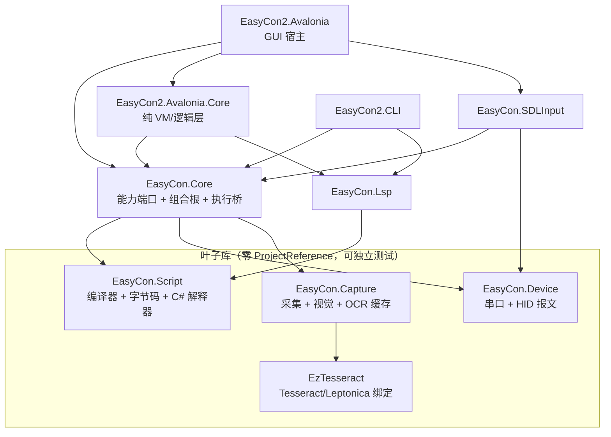

# 系统架构设计

> 本文是**现状**架构说明，描述代码里真实成立的分层与职责。改架构先改本文。
> 编译链路细节见 [Pipeline.md](Pipeline.md)，模块系统见 [ModuleSystem.md](ModuleSystem.md)，
> 双端语义契约见 [VmSemanticContract.md](VmSemanticContract.md)，
> MCU 产物下发见 [McuBytecodeDelivery.md](McuBytecodeDelivery.md)。

## 1. 定位与技术栈

伊机控 EasyCon 是 Nintendo Switch 自动化工具：串口单片机充当虚拟手柄、采集卡/摄像头提供画面、
自研 ECS 脚本语言编排流程，另有一个内置 AI Agent 可读写脚本与驱动运行。

- .NET 10.0 / C#（`LangVersion=preview`）、Avalonia 12 跨平台 GUI
- OpenCV 5（OpenCvSharp5）视觉匹配、自研 Tesseract 绑定 OCR、可选 ONNX 推理
- 自研编译器 + 字节码 + 双端解释器（桌面 C# / 单片机 C99）
- 集中包管理（`Directory.Packages.props`）、NUnit 测试

**入口**：`src/EasyCon2.Avalonia`（GUI）、`src/EasyCon2.CLI`（`ezcon` 命令行）。

## 2. 分层与依赖方向（真实图）

**不存在工程级循环依赖**：`EasyCon.Script` / `EasyCon.Device` / `EasyCon.Capture` / `EzTesseract`
四个叶子库内部 `grep EasyCon.Core` 零命中。

### 2.1 `EasyCon.Core` 是组合根，不是底层

这是最容易读错的一处：`EasyCon.Core` 名字像"核心抽象层"，实际是**能力端口 + 组合根**的混合体。

- 它**向上**被 SDLInput / Lsp / Avalonia.Core / CLI 依赖；
- 它**向下**引用 Script / Device / Capture 三个实现库，从而把 OpenCV、Tesseract 拉进自己的依赖闭包。

因此：

| 规则 | 原因 |
|---|---|
| 不得从 Script/Device/Capture/EzTesseract 反向引用 Core | 保持四个叶子库零依赖，可独立编译与差分测试 |
| 不得在 `Hosting/ScriptHostAssembler` 之外构造 `CapabilitySet` | 装配规则只能有一处（见 §5.1） |
| 不得手写 `CompileOptions` 字面量 | 档位语义集中在 `Hosting/ScriptCompileProfiles`（见 §5.2） |
| 新增能力端口时同步更新 `CapabilitySet` 与装配器 | 端口与装配必须一起演化 |

## 3. 六条架构支柱

1. **能力模型（Ports & Adapters）**：脚本执行面只认 `EasyCon.Core.Capabilities` 的接口
   （`IPadInput` / `IConsoleIo` / `IHostEnvironment` / `IFileSystem` / `ICaptureSource` /
   `IVisionService` / `IOcrService` / `IInference`），`null` 表示"该能力不可用"。
   VM 核（`EcxInterpreter` / `ecs_vm.c`）完全不感知这些类型。
2. **单一编译链路**：源码 → 模块图 → 逐模块独立编译 → 链接 → `EcxImage`，
   桌面解释器与单片机 C VM 消费同一镜像（细节见 [Pipeline.md](Pipeline.md)）。
3. **内容寻址的模块系统**：接口哈希（Merkle 式）决定失效范围，实现体改动不触发下游重编
   （细节见 [ModuleSystem.md](ModuleSystem.md)）。
4. **双端语义契约**：C# 解释器与 C VM 的行为逐条锁定在 S-01..S-19，并由 corpus 三方对拍 +
   结构化 fuzz 保障（见 [VmSemanticContract.md](VmSemanticContract.md)）。
5. **编译器强制的 MVVM 纯度**：`EasyCon2.Avalonia.Core` 零 Avalonia 包引用，
   ViewModel 一旦引入 Avalonia 类型即编译失败。
6. **单一事实源落点表**：[Pipeline.md §4](Pipeline.md) 为每条"只该存在一处"的知识指定文件，
   改对应知识只动一处（指令格式、syscall 编号、内置函数清单、缓存键选项……）。

## 4. 模块职责

| 工程 | 职责 | 关键类型 |
|---|---|---|
| `EasyCon.Script` | 词法/语法/AST → 绑定/类型检查 → SSA + 优化 → 字节码编码 → 模块编译与缓存 → 链接 → C# 解释器 | `Compilation`、`Binder`、`SsaOptimizer`、`BytecodeEncoder`、`EcxLinker`、`EcxInterpreter`、`ModuleCache` |
| `EasyCon.Capture` | 采集源枚举与打开、`FrameStore` 租约、模板匹配/边缘检测、OCR 引擎缓存（Tesseract / ONNX 后端） | `FrameStore`/`FrameLease`、`FrameProducer`、`MatchFacts`、`OcrEngineCache` |
| `EasyCon.Device` | 串口协议（0xA5 帧头、Hello 握手、115200→9600 回退）、HID 报文构建、发送队列与节流、录制、Flash | `IConnection`、`TTLSerialClient`、`NintendoSwitch`、`SwitchReport` |
| `EzTesseract` | 手写 Tesseract/Leptonica 绑定（`[LibraryImport]` + `DllImportResolver`，为 AOT 与体积只封 12 个入口） | `NativeLoader`、`Engine`、`Page`、`Pix.Image` |
| `EasyCon.Core` | 能力端口 + 组合根（`Hosting/`）+ 脚本门面（`Script/`）+ 执行桥（`Runner/EcxVm`）+ 配置（`Config/ConfigManager`）+ LLM 客户端（`LLM/`） | `CapabilitySet`、`ScriptHostAssembler`、`ScriptCompileProfiles`、`IScriptEngine`、`EcxVm` |
| `EasyCon.SDLInput` | SDL3 事件循环（不抢焦点全局键盘）、键盘/手柄 → HID 映射、整表原子替换 | `SdlEventLoop`、`SdlKeyboardInputBinder`、`SdlGamepadMapper` |
| `EasyCon.Lsp` | ECS 语言服务：补全/悬停/跳转/符号/诊断；只复用 Script 的语法树，不求值不产码 | `EcsLanguageServer`、`DocumentManager`、`Constants` |
| `EasyCon2.Avalonia.Core` | 纯 VM/逻辑层：脚本服务、日志服务、配置服务、AI Agent 编排、MCP 客户端、标签编辑器、终端、LSP 客户端 | `ScriptService`、`AgentOrchestrator`、`ToolRegistry`、`McpManager`、`LspClientService` |
| `EasyCon2.Avalonia` | GUI 宿主：View/控件、平台服务实现（设备/采集/手柄/对话框/窗口/主题）、`VPad/` 虚拟手柄 | `MainWindowViewModel`、`CaptureService`、`DeviceService`、`ControllerService` |
| `EasyCon2.CLI` | `ezcon`：`run` / `port` / `video` / `format` / `ir` / `modules` / `compile` / `lsp` | `Program.cs`、`ConsoleOutAdapter` |
| `EasyCon.Vm`（原生，不在 slnx） | 单片机端字节码解释器 + 参考宿主；由 `ci/build-vm.sh` 与测试侧 `CvmRunner` 构建 | `ecs_vm.c/h`、`ecs_main.c` |

## 5. 组合与生命周期

### 5.1 没有 DI 容器，只有显式组合

全仓无 `IServiceCollection` / `IServiceProvider`。对象图靠构造函数显式传递，装配点只有两个：

- GUI：`src/EasyCon2.Avalonia/App.axaml.cs` 的 `OnFrameworkInitializationCompleted`
  （日志 → 设备 → 采集 → 脚本 → 手柄 → 对话框/窗口 → `MainWindowViewModel`，退出时统一释放）
- CLI：`src/EasyCon2.CLI/Program.cs` 各子命令的 `SetAction`

**唯一的能力装配点是 `EasyCon.Core/Hosting/ScriptHostAssembler`。** 宿主只提供"原料"
（`ScriptHostContext`：pad、帧/ROI/标签委托、控制台、参数、AppDir），由装配器负责：

- 适配器包装（`PadInputAdapter` / `ConsoleIoAdapter` / `DelegateCaptureSource` / `DelegateVisionService`）
- 默认值（`IHostEnvironment` 恒装配；`IFileSystem` 缺省桌面实现；OCR/DNN 缺省装配但可关）
- 生命周期（返回 `CapabilityLease`，`Dispose` 释放 OCR 引擎与推理会话）

模块划分见 `Capabilities/`（端口）与 `Hosting/`（组合），二者不可互相渗透。

### 5.2 编译档位

`Hosting/ScriptCompileProfiles` 集中定义两个档位，宿主不得手写选项：

| 档位 | 槽位 | 缓存 | 产物去向 |
|---|---|---|---|
| `Desktop` | PC 宽槽位 | 不落盘、现编 | 只供桌面 `EcxInterpreter`。含 `PcCode` 时 `EcxWriter`/`EcmFormat` **拒绝序列化** |
| `Portable` | 冻结 8 位槽位 | 启用 `obj/` 内容寻址缓存 | 可落 `.ecx` 交 C VM；MCU 分发的唯一合法档位 |

超 255 槽位的函数在 `Portable` 下编译期响亮失败（不静默截断），这是刻意的"产物过大天然不可执行"策略。

## 6. 三条主链路

**脚本执行**：`IScriptEngine.FromSource/LoadFile` → `IScriptSession.Info`（诊断/镜像/符号/KeyAction/NeedIL）
→ `ScriptHostAssembler.Assemble` → `IScriptSession.Run(token, capabilities)` → `EcxVm.Run`
→ `EcxInterpreter` → 经 `EcxHost` 委托回调宿主能力。

**设备控制**：`IPadInput` → `GamePadAdapter` → `NintendoSwitch`（30 ms 节流）→ `TTLSerialClient`
发送队列 → `SwitchReport.GetBytes()` → 串口 → MCU。

**图像识别**：`ICaptureSource`/`FrameDelegate` ← `FrameProducer`/`FrameStore` 租约；
`IVisionService.MatchLabel` ← `ImgLabel.Search`（模板匹配 / 边缘 / OCR 分支）；帧一律以 Base64 PNG 过接口。

## 7. 已知短板（改相关代码前先读）

| 短板 | 位置 |
|---|---|
| MCU 字节码下发链路断裂：GUI 烧录入口抛 `NotImplementedException`，桌面档产物不可序列化 | [McuBytecodeDelivery.md](McuBytecodeDelivery.md) |
| GUI 与 CLI 各自维护一份"连接-采集-释放"编排（能力装配已收敛，编排尚未） | `App/Services/*` vs `Program.cs` |
| 上帝类：`MainWindowViewModel`(1745)、`EcxInterpreter`(1486)、`AgentOrchestrator`(806) | — |
| 少数 VM 带 Avalonia 渲染类型，位于编译器强制区之外 | `EasyCon2.Avalonia/ViewModels/` |
| 公共面偏大（Script 126 / Avalonia.Core 93 / Core 84 个 public 类型） | — |
| AI Agent 工具无审批闸门，`ApiKey` 明文落盘 | `AiAgent/`、`Core/LLM/` |
| `EasyCon2.UI.Common` 退化为 resx 容器；`ViewLocator` 是死代码 | — |

## 8. 相关文档

- [Pipeline.md](Pipeline.md) — 统一编译链路与单一事实源落点
- [ModuleSystem.md](ModuleSystem.md) — 接口式独立编译与缓存
- [VM2.md](VM2.md) / [VmSemanticContract.md](VmSemanticContract.md) / [EcmEcxFormat.md](EcmEcxFormat.md) — 虚拟机规格
- [McuBytecodeDelivery.md](McuBytecodeDelivery.md) — MCU 产物编译与烧录方案
- [Script.md](Script.md) / [Functions.md](Functions.md) — 脚本语言与函数手册
- `AGENTS.md` — 工程约定与"改代码前必读"的分层规则
